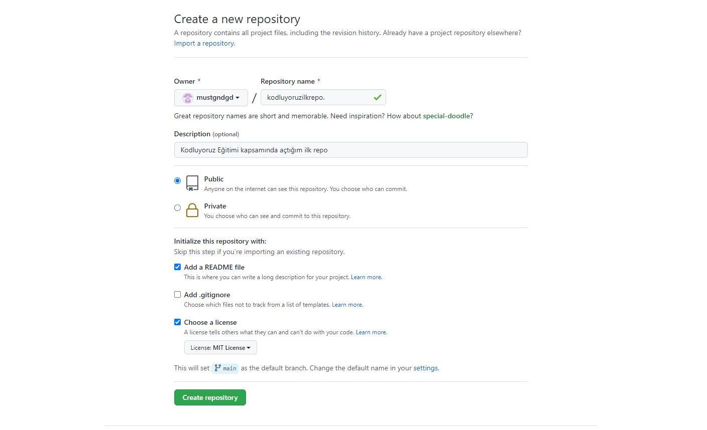

# Kodluyoruz İlk Repo
Bu repo [Kodluyoruz](http://kodluyoruz.com) Front-End Eğitiminde oluşturduğumuz ilk repo. İçerisinde bir adet README dosyası,bir adet index.html barındırıyor.



# Installation

Öncelikle projeyi clonlayın [Clone Link](https://github.com/mustgndgd/kodluyoruzilkrepo.git)

```
git clone git clone https://github.com/mustgndgd/kodluyoruzilkrepo.git
```

# Usage

Projeyi cloneladıktan sonra Visual Studio Code programında açınız.

Linux için:

```
cd kodluyoruzilkrepo
code.
```
# Contributing

Pull requestler kabul edilir. Büyük değişiklikler için önce neyi değiştirmek istediğinizi tartışmak için bir konu açınız.

# License

[MIT](https://choosealicense.com/licenses/mit/)